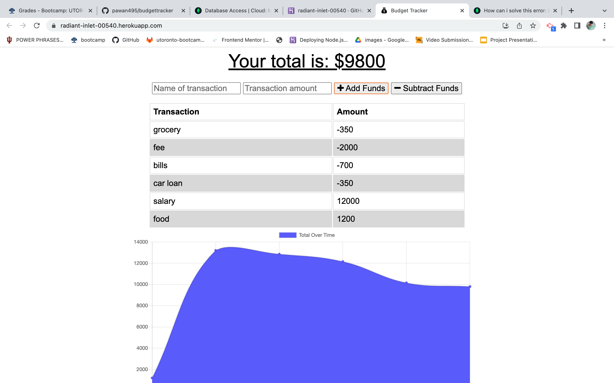

## Progressive Web Applications (PWA): Budget Tracker

### Description

Giving users a fast and easy way to track their money is important, but allowing them to access that information at any time is even more important. Having offline functionality is paramount to the success of an application that handles users’ financial information.

## Install and Start app
If you have Install npm, then type npm start in your vs code and type localhost:3001 in your browser. You see NoteTaker there. for install package for npm(https://phoenixnap.com/kb/install-npm-mac)

## App Screenshot

## Deployed to Heroku
https://radiant-inlet-00540.herokuapp.com/

